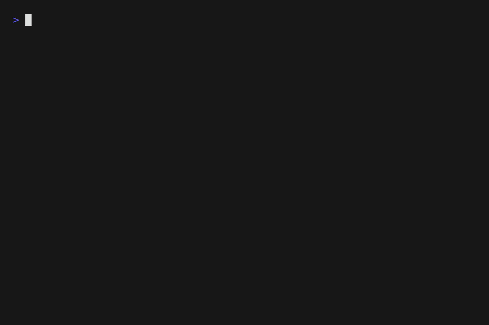

# MT - Project Management CLI

`mt` is a purpose-built CLI designed to bridge the gap between Docker and your daily development workflow. Instead of memorizing complex container flags or repeating tedious setup tasks, mt provides a unified interface to manage your entire local environment.

It acts as the command center for your local stack, tailored specifically for developers who need to move quickly between backend tasks, frontend builds, and database management.

`mt` handles the heavy lifting so you can stay in the "flow state" longer.


[](https://github.com/mattia37773/mt/commits)
[](https://github.com/mattia37773/mt/issues)
[](https://github.com/mattia37773/mt/stargazers)

<p align="center">
  
</p>

## Features

- **Stack Orchestration:** Simplified commands for Docker Compose operations.
- **Database Management:** Efficient database import/export workflows and shell access to database containers (supports MongoDB, MySQL).
- **PHP Integration:** Native support for PHP development tasks

## Installation

<details>
<summary>Pre-built Binaries</summary>

You can download the latest pre-compiled binaries directly from the [GitHub Releases](https://github.com/mattia37773/mt/releases) page.

</details>

<details>
<summary>From Source</summary>
Ensure you have Go 1.25.4 or later installed, then run the following commands:

```bash
git clone https://github.com/Mattia37773/mt.git
cd mt
go build
./mt
```

</details>

<details>
<summary>GO</summary>
Ensure you have Go 1.25.4 or later installed.

First, add the Go binary directory to your system path if you haven't already:

```bash
echo 'export PATH=$PATH:$(go env GOPATH)/bin' >> ~/.bashrc
```

Then, install the package directly using:

```bash
go install -ldflags "-X github.com/mattia37773/mt/config.BuildMethod=go" github.com/mattia37773/mt@latest
```

</details>

## Usage

Manage your Docker environment efficiently with the following commands:

| Base Command | Command    | Description                                        |
| :----------- | :--------- | :------------------------------------------------- |
| **stack**    |            |                                                    |
|              | build      | Build the docker images                            |
|              | start      | Start the project stack                            |
|              | stop       | Stop all services                                  |
|              | restart    | Restart the project stack                          |
|              | destroy    | Destroy the project stack                          |
|              | logs       | View real-time container logs                      |
|              | ps         | List container information                         |
| **db**       |            |                                                    |
|              | shell      | Open a shell in the database container             |
|              | import-db  | Interactive database import                        |
|              | export-db  | Export current database state                      |
| **php**      |            |                                                    |
|              | console    | Run Symfony console commands                       |
|              | phpunit    | Execute test suite                                 |
|              | phpstan    | Run static analysis                                |
|              | csfixer    | Run the PHP Coding Standards Fixer                 |
|              | craft      | Run the Craft CMS CLI inside a container           |
| **other**    |            |                                                    |
|              | composer   | Run Composer inside the container                  |
|              | bun        | Run Bun inside the container                       |
|              | npm        | Run NPM inside the container                       |
|              | yarn       | Run Yarn inside the container                      |
|              | run        | Execute a command inside a container               |
|              | shell      | Open a shell for a specific container              |
|              | launch     | Open the primary URL in the browser                |
|              | completion | Generate shell autocompletion scripts              |
|              | config     | Generate a configuration file to override defaults |
|              | update     | Updates the CLI                                    |

## Configuration

`mt` looks for a `.mt.yaml` file in the project root to manage stack configuration.

```yaml
# .mt.yaml
projectCompose:
  paths:
    dockerCompose: docker/docker-compose.yaml
    env: docker/.env
  db:
    containerName: "db"
    type: "mysql"
    name: "appDb"
    user: "uDb"
    password: "password"
  backend:
    containerName: fpm
  frontend:
    containerName: fpm
```

It also needs these 2 environment variables:

```env
PROJECT_NAME=example # Expected default name & container prefix
PRIMARY_SITE_URL=http://localhost:8080
```

## Contributing

We welcome contributions to improve this project.

1. Fork the repository.
2. Create your feature branch.
3. Open a Pull Request.

## Roadmap

- Support for additional programming languages and frameworks.
- Expansion of supported database engines.

## License

This project is licensed under the MIT License. See the `LICENSE` file for details.

---

Created by [Matze](https://github.com/Mattia37773)
